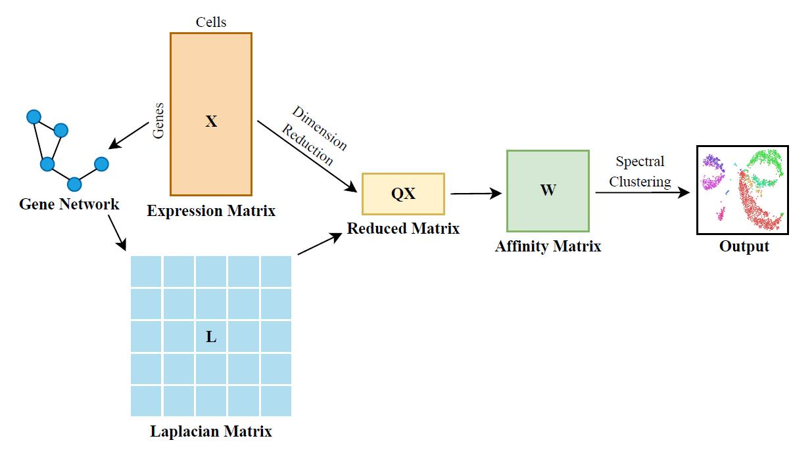

# NetworkSSC

With the rapid development of single-cell RNA sequencing (scRNA-seq) technology, people are able to investigate gene expression at the individual cell level. Identification of cell types via unsupervised clustering is one of the fundamental issues in analyzing single-cell data. However, due to the high dimensionality of expression profiles, traditional clustering methods are difficult to generate satisfactory results. To address this problem, we designed NetworkSSC, a network-guided sparse subspace clustering (SSC) approach. NetworkSSC is based on a similar assumption in SSC that the expression of cells within the same type lies in the same subspace. Moreover, it integrates an additional regularization term to include the gene network's Laplacian matrix, so as to utilize the functional association between genes. The comparison results of five scRNA-seq datasets show that NetworkSSC outperforms ordinary SSC and other clustering methods in most cases.
